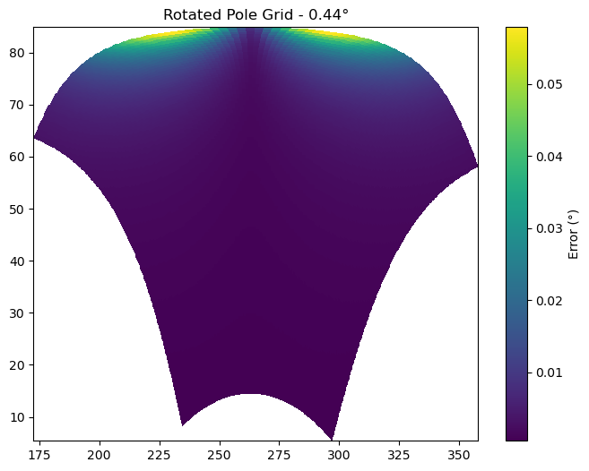
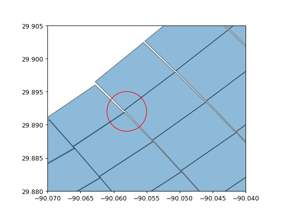
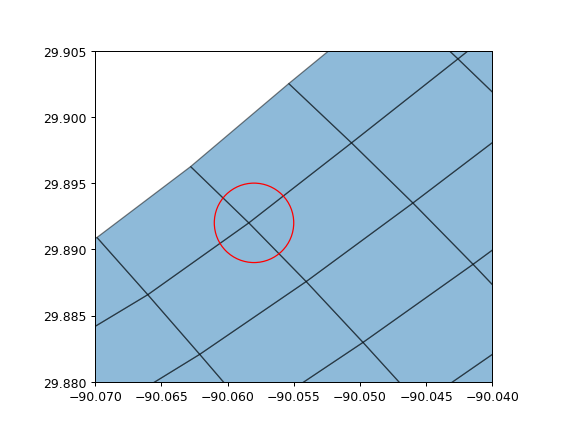

```{eval-rst}
.. currentmodule:: xarray
```

# Bounds Variables

See

1. {py:attr}`Dataset.cf.bounds`,
1. {py:func}`Dataset.cf.add_bounds`,
1. {py:func}`cf_xarray.bounds_to_vertices`,
1. {py:func}`cf_xarray.vertices_to_bounds`

`cf_xarray` supports parsing [coordinate bounds](http://cfconventions.org/Data/cf-conventions/cf-conventions-1.10/cf-conventions.html#cell-boundaries) as encoded in the CF `bounds` attribute. A useful feature for incomplete dataset is also the automatic bounds estimation possible through `cf.add_bounds`. This method will estimate the missing bounds by finding the middle points between elements of the given coordinate, but also by extrapolating to find the outer bounds of the grid. This linear estimation works well with rectilinear grids, but it is only a coarse approximation for curvilinear and simple irregular grids.

As an example, we present a "rotated pole" grid. It is defined on a rotated rectilinear grid which uses the `rlat` and  `rlon` 1D coordinates, over North America at a resolution of 0.44°. The datasets comes with 2D `lat` and `lon` coordinates. `cf_xarray` will estimate the bounds by linear interpolation (extrapolation at the edges) of the existing `lon` and `lat`, which yields good results on parts of the grid where the rotation is small. However the errors is larger in other places, as seen when visualizing the distance in degrees between the estimated bounds and the true bounds.



For grids with a strong curvature between the cartesian axes and the lat/lon coordinates, the basic linear interpolation done for each point individually can yield grid cells with unmatching corners. The next figure shows such a case as it would be expected that the 4 corners within the red circle would all be the same point. To circumvent this issue, `cf_xarray` will average together these 4 different results, as shown on the last figure.




This last examples illustrates again that `cf_xarray` can only estimate the grid bounds, grid metrics provided by the data producer will always be better.
