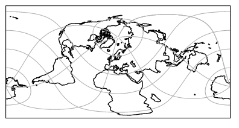

---
jupytext:
  text_representation:
    format_name: myst
kernelspec:
  display_name: Python 3
  name: python3
---

```{eval-rst}
.. currentmodule:: xarray
```

# Grid Mappings

See

1. {py:attr}`Dataset.cf.grid_mapping_names`,
1. {py:attr}`DataArray.cf.grid_mapping_name`

`cf_xarray` understands the concept of coordinate projections using the [grid_mapping](https://cfconventions.org/Data/cf-conventions/cf-conventions-1.10/cf-conventions.html#grid-mappings-and-projections) attribute convention. For example, the dataset might contain two sets of coordinates:

- native coordinates in which the data is defined, e.g., regular 1D coordinates
- projected coordinates which probably denote some "real" coordinates in [latitude and longitude](https://en.wikipedia.org/wiki/Geographic_coordinate_system#Latitude_and_longitude)

Due to the projection, those real coordinates are probably 2D data variables. The `grid_mapping` attribute of a data variable makes a connection to another data variable defining the coordinate reference system (CRS) of those native coordinates. It should enable you to project the native coordinates into any other CRS, including the real 2D latitude and longitude coordinates. This is often useful for plotting, e.g., you can [tell cartopy how to correctly plot coastlines](https://scitools.org.uk/cartopy/docs/latest/tutorials/understanding_transform.html) for the CRS your data is defined in.

## Extracting grid mapping info

### Dataset

To access `grid_mapping` attributes, consider this example:

```{code-cell}
from cf_xarray.datasets import rotds

rotds
```

The related grid mappings can be discovered using `Dataset.cf.grid_mapping_names` which maps a
["grid mapping name"](http://cfconventions.org/cf-conventions/cf-conventions.html#appendix-grid-mappings) to the
appropriate variable name:

```{code-cell}
rotds.cf.grid_mapping_names
```

Access the `grid_mapping` variable as

```{code-cell}
rotds.cf["grid_mapping"]
```

### DataArrays

Grid mapping variables are propagated when extracting DataArrays:

```{code-cell}
da = rotds.cf["temp"]
da
```

To find the grid mapping name use the singular {py:attr}`DataArray.cf.grid_mapping_name`

```{code-cell}
da.cf.grid_mapping_name
```

And to get the grid mapping variable

```{code-cell}
da.cf["grid_mapping"]
```

## Use `grid_mapping` in projections

The grid mapping information use very useful in projections, e.g., for plotting. [pyproj](https://pyproj4.github.io/pyproj/stable/api/crs/crs.html#pyproj.crs.CRS.from_cf) understands CF conventions right away, e.g.

```python
from pyproj import CRS

CRS.from_cf(rotds.cf["grid_mapping"].attrs)
```

gives you more details on the projection:

```
<Derived Geographic 2D CRS: {"$schema": "https://proj.org/schemas/v0.2/projjso ...>
Name: undefined
Axis Info [ellipsoidal]:
- lon[east]: Longitude (degree)
- lat[north]: Latitude (degree)
Area of Use:
- undefined
Coordinate Operation:
- name: Pole rotation (netCDF CF convention)
- method: Pole rotation (netCDF CF convention)
Datum: World Geodetic System 1984
- Ellipsoid: WGS 84
- Prime Meridian: Greenwich
```

For use in cartopy, there is some more overhead due to [this issue](https://github.com/SciTools/cartopy/issues/2099). So you should select the right cartopy CRS and just feed in the grid mapping info:

```python
from cartopy import crs as ccrs

grid_mapping = rotds.cf["grid_mapping"]
pole_latitude = grid_mapping.grid_north_pole_latitude
pole_longitude = grid_mapping.grid_north_pole_longitude

ccrs.RotatedPole(pole_longitude, pole_latitude)
```


