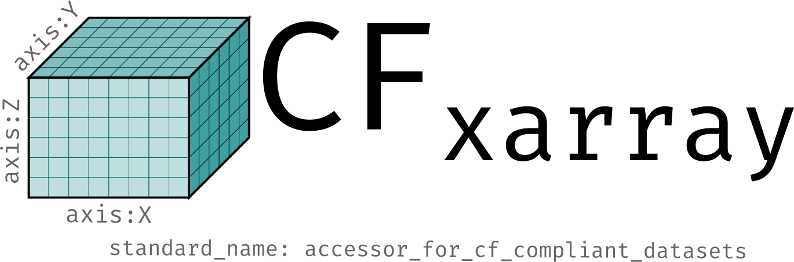

|
|

|
|

Welcome to ``cf_xarray``
========================

``cf_xarray`` mainly provides an accessor (``DataArray.cf`` or ``Dataset.cf``) that allows
you to interpret `Climate and Forecast metadata convention <http://cfconventions.org/>`_ attributes present on `xarray <https://xarray.pydata.org>`_ objects.

Installing
----------

``cf_xarray`` can be installed using ``pip``

    >>> pip install cf_xarray

or using ``conda``

    >>> conda install -c conda-forge cf_xarray

.. toctree::
   :maxdepth: 2
   :hidden:
   :caption: In-depth Examples

   examples/introduction
   EarthCube 2021 demo <https://earthcube2021.github.io/ec21_book/notebooks/ec21_cherian_etal/DC_01_cf-xarray.html>
   CESM ocean model demo <https://pop-tools.readthedocs.io/en/latest/examples/cesm-cmip-cf-xarray.html>
   COSIMA ocean-sea ice model demo <https://cosima-recipes.readthedocs.io/en/latest/Tutorials/Model_Agnostic_Analysis.html>

.. toctree::
   :maxdepth: 2
   :hidden:
   :caption: User Guide

   quickstart
   howtouse
   faq
   coord_axes
   selecting
   flags
   units
   parametricz
   bounds
   grid_mappings
   coding
   dsg
   sgrid_ugrid
   geometry
   plotting
   custom-criteria
   provenance
   API Reference <api>

.. toctree::
   :maxdepth: 2
   :hidden:
   :caption: For contributors

   Contributing Guide <contributing>
   Development Roadmap <roadmap>
   Whats New <whats-new>
   GitHub repository <https://github.com/xarray-contrib/cf-xarray>
