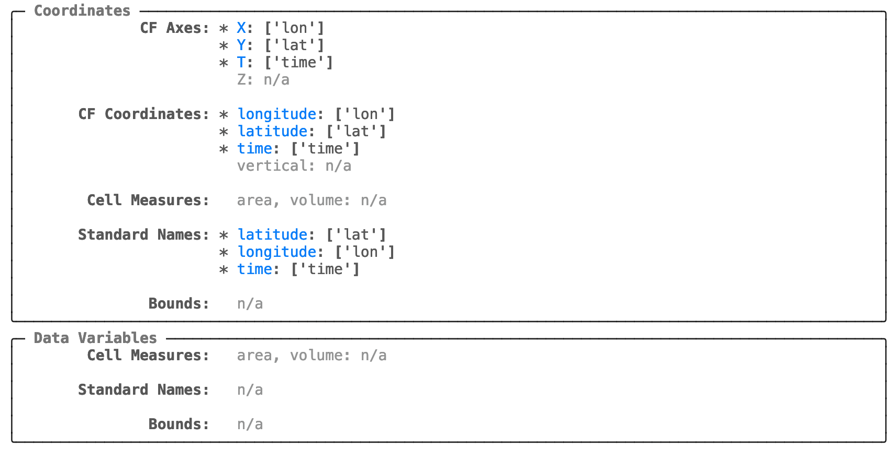

---
jupytext:
  text_representation:
    format_name: myst
kernelspec:
  display_name: Python 3
  name: python3
---

```{eval-rst}
.. currentmodule:: xarray
```

```{code-cell}
---
tags: [remove-cell]
---
import xarray as xr
xr.set_options(display_expand_data=False)
```

# Quickstart

`cf_xarray` allows you to write code that works on many datasets by interpreting CF-compliant attributes (`.attrs`) present on xarray {py:class}`~xarray.DataArray` or {py:class}`~xarray.Dataset` objects. First, let's load a dataset.

```{code-cell}
import cf_xarray as cfxr
import xarray as xr

xr.set_options(keep_attrs=True)

ds = xr.tutorial.open_dataset("air_temperature")
ds
```

## Finding CF information

`cf_xarray` registers an "accessor" named `cf` on import. For a quick overview of attributes that `cf_xarray` can interpret use `.cf` This will display the "repr" or a representation of all detected CF information.

```{code-cell}
ds.cf
```

The plain text repr can be a little hard to read. In a Jupyter environment simply install [`rich`](https://rich.readthedocs.io) and
use the Jupyter extension with `%load_ext rich`. Then `ds.cf` will automatically use the `rich` representation.
See [the rich docs](https://rich.readthedocs.io/en/stable/introduction.html#ipython-extension) for more.

```python
%load_ext rich

ds.cf
```



## Using attributes

Now instead of the usual xarray names on the right, you can use the "CF names" on the left.

```{code-cell}
ds.cf.mean("latitude")  # identical to ds.mean("lat")
```

This works because the attributes `standard_name: "latitude"` and `units: "degrees_north"` are present on `ds.latitude`

```{code-cell}
ds.lat.attrs
```

```{tip}
For a list of criteria used to identify the "latitude" variable (for e.g.) see {ref}`coordinate-criteria`.
```

Similarly we could use `ds.cf.mean("Y")` because the attribute `axis: "Y"` is present.

```{tip}
For best results, we recommend you tell xarray to preserve attributes as much as possible using `xr.set_options(keep_attrs=True)`
but be warned, this can preserve out-of-date metadata.
```

```{tip}
Sometimes datasets don't have all the necessary attributes. Use {py:meth}`~xarray.Dataset.cf.guess_coord_axis`
and {py:meth}`~xarray.Dataset.cf.add_canonical_attributes` to automatically add attributes to variables that match some heuristics.
```

## Indexing

We can use these "CF names" to index into the dataset

```{code-cell}
ds.cf["latitude"]
```

This is particularly useful if a `standard_name` attribute is present. For demonstration purposes lets add one:

```{code-cell}
ds.air.attrs["standard_name"] = "air_temperature"
ds.cf["air_temperature"]
```

## Finding variable names

Sometimes it is more useful to extract the actual variable names associated with a given "CF name". `cf_xarray` exposes these variable names under a few properties:

- {py:attr}`Dataset.cf.axes`,
- {py:attr}`Dataset.cf.bounds`,
- {py:attr}`Dataset.cf.cell_measures`,
- {py:attr}`Dataset.cf.cf_roles`,
- {py:attr}`Dataset.cf.coordinates`,
- {py:attr}`Dataset.cf.formula_terms`,
- {py:attr}`Dataset.cf.grid_mapping_names`, and
- {py:attr}`Dataset.cf.standard_names`.

These properties all return dictionaries mapping a standard key name to a list of matching variable names in the Dataset or DataArray.

```{code-cell}
ds.cf.axes
```

```{code-cell}
ds.cf.coordinates
```

```{code-cell}
ds.cf.standard_names
```
